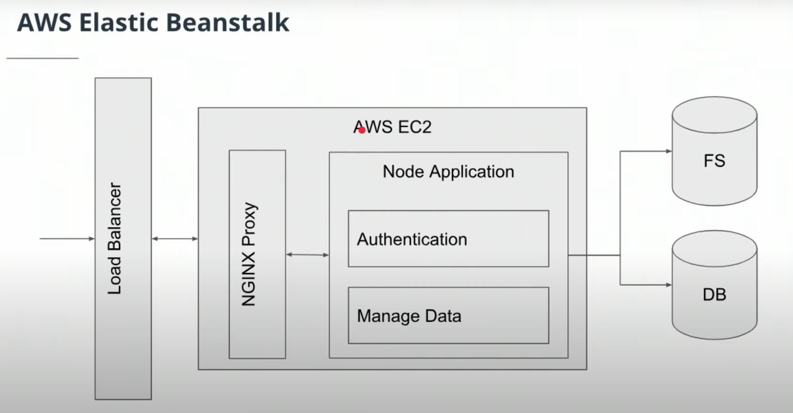

# Full stack web



- [Full stack web](#full-stack-web)
  - [Storing Data](#storing-data)
    - [SignedUrl Pattern](#signedurl-pattern)
  - [Building and Deploying](#building-and-deploying)
    - [Modular code and organization (easy refactor and improvement in the future)](#modular-code-and-organization-easy-refactor-and-improvement-in-the-future)
    - [**Environment Variblaes** for `secret` and `configuration`!!!!!!!!!!!!!!](#environment-variblaes-for-secret-and-configuration)
  - [User authentication and security](#user-authentication-and-security)
    - [Password Encryption](#password-encryption)
    - [Storing authentication on client side](#storing-authentication-on-client-side)
    - [Sessions, JWTs, and Environment Variables](#sessions-jwts-and-environment-variables)
    - [Security policies](#security-policies)
  - [Scaling and Fixing](#scaling-and-fixing)
    - [Scaling](#scaling)
    - [Monitoring, Testing and Debugging](#monitoring-testing-and-debugging)

## Storing Data

- `Database: RDS`: store structured data; metadata; user data; not big; used for searching
  - Index:
    - `B-Tree`: a generalization of a binary search tree, which stores sorted data, but can have more than 2 child nodes.
    - `Bloom Filters`: a data structure that is useful for determining if an item is probably in a data set, or definitely not in the data set. Bloom filters don’t actually store the data themselves.
- `File/Object Store: S3` store unstructured data; binary data; big
  - e.g. videos, images, document (i.e. .pdf, .doc)
  - Allow archieve based on lifecycle policy

### SignedUrl Pattern


- Client retrieves data directly from S3 instead of server sending back the files
  - reduce server workload
  - This requirs [`CORS`](https://developer.mozilla.org/en-US/docs/Web/HTTP/CORS) to set up on S3 to make it work.

## Building and Deploying

### Modular code and organization (easy refactor and improvement in the future)

```bash
.  # <-- ./src
├── aws.ts
├── config
│   └── config.ts
├── controllers
│   └── v0
│       ├── feed
│       │   ├── models
│       │   │   └── FeedItem.ts
│       │   └── routes
│       │       └── feed.router.ts
│       ├── index.router.ts
│       ├── model.index.ts
│       └── users
│           ├── models
│           │   └── User.ts
│           └── routes
│               ├── auth.router.ts
│               └── user.router.ts
├── migrations
│   ├── 20190325-create-feed-item.js
│   └── 20190328-create-user.js
├── sequelize.ts
└── server.ts
```

### **Environment Variblaes** for `secret` and `configuration`!!!!!!!!!!!!!!

i.e. [config.ts](../course-02/exercises/udacity-c2-restapi/src/config/config.ts)

## User authentication and security

### Password Encryption

**Never** store plain text password

| Strategies            | Pro                                                                 | Cons                                                |
| --------------------- | ------------------------------------------------------------------- | --------------------------------------------------- |
| Two-way password Hash | easy to implement; storing hash                                     | you can get the original password when unhashing it |
| One-way password Hash | Compare stored hash and the user-input password after hashing       | Create `rainbow table` to steal the password        |
| One-way Salted Hash   | extra secure; more difficult to steal password with `rainbow table` | highest latency?                                    |

### Storing authentication on client side

- improve user experiences and performance: no need to keep logging in

| Method                                  | Description                                                                                                             |
| --------------------------------------- | ----------------------------------------------------------------------------------------------------------------------- |
| Cookies & session ID                    | Old-style: You need to check with the DB/Server to see if it is valid authenticaion and the corresponding authorization |
| [JSON Web Token - JWT](https://jwt.io/) | Modern method: self-contained encrypted string that contains authentication and authorization; no need to do DB look-up |

### Sessions, JWTs, and Environment Variables

Our client can be a web browser or another server. In either of these cases, we need to send some authentication information along with each request.

- **web browser**: this is most commonly performed by storing some kind of credentials in something like the [localstorage](https://developer.mozilla.org/en-US/docs/Web/API/Window/localStorage) which allows us to store information for a specific site in a key-value store. JSON Web Tokens are one type of credential that can be stored locally in this fashion.
- **servers**: we'll usually want to use something like an `environment variable`. This is a variable which is accessible within that instance and only that instance.

### Security policies

- [NPM](https://www.npmjs.com/policies/security)
- [Nylas](https://www.nylas.com/security/)
- [AWS](https://aws.amazon.com/security/)

## Scaling and Fixing

### Scaling

- `DNS`
  - `A record`: a domain name that maps to IP
  - `CNAME`: a domain name that maps to another domain name
- `CDN`
  - Serve frontend `static build artifacts` to speed up resource retrival for users
  - i.e. AWS S3 + CloudFront

### Monitoring, Testing and Debugging

- Monitoring
  - i.e. [`Datadog`](https://www.datadoghq.com/product/), [CloudWatch](https://aws.amazon.com/cloudwatch/)
- Testing
  - Load testing
  - Penetration testing
  - User Acceptance testing
- Debugging
  - i.e. [`Sentry`](https://sentry.io/)