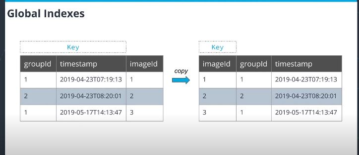

# Serverless

- [Serverless](#serverless)
  - [Lambda](#lambda)
    - [Invocation types](#invocation-types)
    - [Size Limit](#size-limit)
    - [Serverless Framwork](#serverless-framwork)
      - [Validate request with JSON schema](#validate-request-with-json-schema)
  - [API Gateway](#api-gateway)
    - [Endpoint types](#endpoint-types)
    - [Integration Modes](#integration-modes)
    - [Options Method](#options-method)
  - [DynamoDB](#dynamodb)
    - [Capacity Modes](#capacity-modes)
    - [Parition (HASH) and Sort (RANGE) key](#parition-hash-and-sort-range-key)
    - [Operations](#operations)
    - [Indexes](#indexes)

## Lambda

### Invocation types

- `Request/Response`
  - If there's an error in the function, then it will return immediately to the caller, which can process the error from the Lambda function.
- `Async method`
  - Always return `HTTP 202` code to the user
  - request stores into an internal queue
  - then call the Lambda function up to 3 times. 
  - If all errors, then it will store the event into a "dead-letter queue"

### Size Limit

- Package size (.zip): up to 50MB
- Unzipped:     250MB

### Serverless Framwork

- `serverless`
- `zappa`: Python
- `SAM` by AWS
- `Claudia.js`: node.js

#### Validate request with JSON schema

i.e.

```json
{
  "$schema": "http://json-schema.org/draft-04/schema#",
  "title": "my-type",
  "type": "object",
  "properties": {
    "name": {
      "type": "string"
    }
  },
  "required": ["name"]
}
```

```yaml
 HttpHandler:
    handler: src/lambda/http/create.handler
    events:
      - http:
          method: post
          path: items
          request:
            # Schema that will be used to validate incoming requests
            schema:
              application/json: ${file(models/create-todo-model.json)}
```

## API Gateway

### Endpoint types

- Edge Optimized Endpoint (with CloudFront in front of API Gateway)
- Regional Endpoint
- Private Endpoint

### Integration Modes

- `Proxy`: passes all request information to lambda function.
- `Non-proxy`: allows to transform incoming request using Velocity Template Language

### Options Method

- When you send a `POST` method to the API, the broswer will first send a `OPTIONS` request to determine if it can actually do a certain action on the resource. If so, then go ahead to send the actual `POST`
- This is related to `CORS`
- Can be easily enabled in API Gateway by `Enable CORS`

## DynamoDB

### Capacity Modes

- On-Demand
- Provisioned capacity

### Parition (HASH) and Sort (RANGE) key

- `Partition key`: data are stored in the same partition
- `Sort key`: within partiton, data are sorted based on sort key

Together they form the `composite key`

### Operations

Two common operations:

- `Query`: query certain items based onfilters
- `Scan`: scan the whole table

In addtion, there are [per item opertaion](https://docs.aws.amazon.com/amazondynamodb/latest/developerguide/WorkingWithItems.html): `GetItem` (`BatchGetItem`), `PutItem` (`BatchWriteItem`), `UpdateItem`, `DeleteItem`

### Indexes

Two type of indexes:

- `Local Secondary Index (LSI)`
  - Addtional sort key: allow sort items by a different attribute
  - Added on the original table
- `Global Secondary Index (GSI)`
  - A new partition key or a new composite key
  - Creates copy of the data (increase storage cost)


