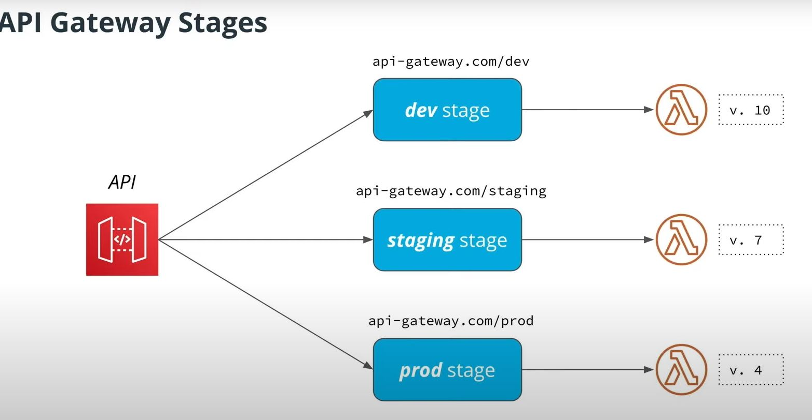

# Serverless

- [Serverless](#serverless)
  - [Architecture](#architecture)
    - [File upload Notifications](#file-upload-notifications)
      - [File upload - Presigned URL](#file-upload---presigned-url)
      - [Websocket Notifications](#websocket-notifications)
      - [Multiple event handler with S3 event](#multiple-event-handler-with-s3-event)
  - [Lambda](#lambda)
    - [Function lifecycle](#function-lifecycle)
    - [Invocation types](#invocation-types)
    - [Resource limit](#resource-limit)
    - [Middleware - `middy`](#middleware---middy)
    - [Error handling](#error-handling)
    - [Serverless Framwork](#serverless-framwork)
      - [YAML format](#yaml-format)
      - [Validate request with JSON schema](#validate-request-with-json-schema)
      - [Local Execution](#local-execution)
      - [Seeding a local database fro testing](#seeding-a-local-database-fro-testing)
    - [Deployment - Blue/Green vs Canary](#deployment---bluegreen-vs-canary)
      - [Canary](#canary)
    - [Serverless Observability - `Three pillars of observability`: Metrics, Logging, Distributed Tracing](#serverless-observability---three-pillars-of-observability-metrics-logging-distributed-tracing)
      - [Logs](#logs)
      - [Ditributed Tracing](#ditributed-tracing)
      - [Metrics](#metrics)
    - [Optimization - Cold Start](#optimization---cold-start)
      - [Code size](#code-size)
      - [Avoid Cold Start Altogether](#avoid-cold-start-altogether)
      - [Function Code](#function-code)
      - [Avoid running in VPC](#avoid-running-in-vpc)
      - [Bootstrapping New Runtime](#bootstrapping-new-runtime)
      - [More memory](#more-memory)
      - [Tunning tool !!!!](#tunning-tool-)
  - [API Gateway](#api-gateway)
    - [Stages](#stages)
    - [Endpoint types](#endpoint-types)
    - [Integration Modes](#integration-modes)
    - [Options Method](#options-method)
  - [DynamoDB](#dynamodb)
    - [When to use](#when-to-use)
    - [Features](#features)
    - [Response JSON Format - Return Item Format](#response-json-format---return-item-format)
    - [Capacity Modes](#capacity-modes)
    - [Parition (HASH) and Sort (RANGE) key](#parition-hash-and-sort-range-key)
    - [Operations](#operations)
    - [Indexes](#indexes)
    - [Pagination](#pagination)
  - [Full-text search](#full-text-search)
    - [Elastic Search](#elastic-search)
    - [Streaming](#streaming)
  - [Authentication](#authentication)
    - [IAM Auth](#iam-auth)
    - [Cognito](#cognito)
    - [Cognito Federated Identity](#cognito-federated-identity)
    - [Custom Authorizer](#custom-authorizer)
  - [Auth0](#auth0)
    - [OAuth Flow](#oauth-flow)
    - [Algorithm for signing JWT Token](#algorithm-for-signing-jwt-token)
      - [Symmetric (HS256)](#symmetric-hs256)
      - [Asymmetric (RS256)](#asymmetric-rs256)
      - [Handling JWT Token](#handling-jwt-token)
  - [Secret Stores](#secret-stores)
  - [Ports and Adapters Architecture](#ports-and-adapters-architecture)
  - [Integration test](#integration-test)
  - [Security](#security)
  - [React Service Worker - Progressive Web App](#react-service-worker---progressive-web-app)

## Architecture

### File upload Notifications


#### File upload - Presigned URL


#### Websocket Notifications


#### Multiple event handler with S3 event

Two event handlers

- [Send a websocket notifications](#websocket-notifications)
- Resize a image

Solution: add a SNS queue between Lambda and S3

- `SQS` - `Pull` based queue
- `SNS` - `Push` based queue


## Lambda

### Function lifecycle


### Invocation types

- `Request/Response`
  - If there's an error in the function, then it will return immediately to the caller, which can process the error from the Lambda function.
- `Async method`
  - Always return `HTTP 202` code to the user
  - request stores into an internal queue
  - then call the Lambda function up to 3 times.
  - If all errors, then it will store the event into a "dead-letter queue"

### Resource limit

More details [here](https://docs.aws.amazon.com/lambda/latest/dg/gettingstarted-limits.html)

- Deployment Package:
  - Package size (.zip): up to 50MB
  - Unzipped:     250MB
- Labmda invocation payload: 6MB

### Middleware - [`middy`](https://github.com/middyjs/middy)

- Abstract away common admin related code i.e. CORS

```typescript
import * as middy from 'middy'
import { cors } from 'middy/middlewares'

export const handler = middy(
  async (event: APIGatewayProxyEvent): Promise<APIGatewayProxyResult> => {
     ...
  }
)

handler
  .use(cors())
```

### Error handling

[AWS Link](https://docs.aws.amazon.com/lambda/latest/dg/with-kinesis.html#services-kinesis-errors)

### Serverless Framwork

- `serverless`
- `zappa`: Python
- `SAM` by AWS
- `Claudia.js`: node.js

#### YAML format

Utility for testing and converting [json2yaml](https://www.json2yaml.com/)

#### Validate request with JSON schema

i.e.

```json
{
  "$schema": "http://json-schema.org/draft-04/schema#",
  "title": "my-type",
  "type": "object",
  "properties": {
    "name": {
      "type": "string"
    }
  },
  "required": ["name"]
}
```

```yaml
 HttpHandler:
    handler: src/lambda/http/create.handler
    events:
      - http:
          method: post
          path: items
          request:
            # Schema that will be used to validate incoming requests
            schema:
              application/json: ${file(models/create-todo-model.json)}
```

#### Local Execution

- Option 1: Run single function locally

  ```bash
  # invoke locally
  sls invoke local
    --function func
    --path <path-to-json-event>
    --contextPath <path-to-json-context>
    # or
    # --event '{"key": "value"}'
    # --context '{"key": "value"}'
  ```

- Option 2: [`serverless-offline`](https://github.com/dherault/serverless-offline) plugin
  
    ```yaml
    plugins:
      - serverless-dynamodb-local
      - serverless-offline

    custom:
      serverless-offline:
        port: 3003
    ```

    ```bash
    # Run DynamoDB locally
    sys dynamodb install
    sls dynamodb start
    # Run webserver locally
    sls offline
    ```

#### Seeding a local database fro testing

For `Dynamodb`

- `dynamodb.start.seed: true` - [more config](https://github.com/99xt/serverless-dynamodb-local#seeding-sls-dynamodb-seed)

### Deployment - Blue/Green vs Canary


#### Canary

- [`serverless-plugin-canary-deployments`](https://www.serverless.com/plugins/serverless-plugin-canary-deployments/)
- [Weighted Alias](https://docs.aws.amazon.com/lambda/latest/dg/configuration-aliases.html)


### Serverless Observability - `Three pillars of observability`: Metrics, Logging, Distributed Tracing


#### Logs

`Elastic Search` is a go-to solution for logging sotrage and analytics. (CloudWatch Logs is good for simple application)


#### Ditributed Tracing


- AWS X-RAY
  - Synchronous: X-RAY API
  - Asychronous: X-RAY Daemon - integrated with Lambda

> For general `event-driven architecture`: attach a `unique ID for each service` that the message pass through to each message. This can be used later to track down the trace.

#### Metrics

Similar to Logs, instead of pushing Metrics to CloudWatch or ElasticSearch within the Lambda context (this introduces extra latency), we write logs to stdout, which will then be picked up by ClouWatch and send to ElasticSearch.

### Optimization - Cold Start

[Best practices](http://bit.ly/lambda-best-practices)

#### Code size

- Smaller functions
  - do not ship `aws-sdk`
  - use `devDependencies`
  - use `Serverless` plugins for optimization
- Split single function into multiple smaller functions
  - single reponsibility function
  - **you need to package those functions separately** - otherwise they wil be the same .zip, but just with different handler functions
  
    ```yaml
    // in the serverless framework
    package:
      individually: true
    ```

#### Avoid Cold Start Altogether

- a special payload (warmup request) - it doesn't execute the function body
  - i.e. [`serverless-plugin-warmup`](https://github.com/FidelLimited/serverless-plugin-warmup) - generate a function that periodically keep all functions warm
  
```typescript
// using `middy`
handler.use(
  warmpup({
    isWarmingUp: event => event.source === 'serverless-plugin-warmup',
    onWarmup: event => return 'It is warm'
  })
)
```

#### Function Code

- Re-use state between executions
  - cache loaded credentials
  - re-use connections between invocations
- Avoid invocation
  - events filters (e.g S3 events filters - i.e. only an object is created; only files with a certain prefixes)
- Avoid `sleep()`
- Send multiple requests in parallel

#### Avoid running in VPC

- only do so if needs an access a pretected endpoint
- it **increases** *cold start* drastically
  - most cases no need

#### Bootstrapping New Runtime

- Go, Node.js, Python >>> Java, .NET
- More memory -> Faster CPU

#### More memory

- May save money
- More memory -> Faster CPU
  - excution time drops -> pay less for execution than the extra memory

#### Tunning tool !!!!

[`aws-lambda-power-tuning`](https://github.com/alexcasalboni/aws-lambda-power-tuning)

## API Gateway

### Stages



### Endpoint types

- Edge Optimized Endpoint (with CloudFront in front of API Gateway)
- Regional Endpoint
- Private Endpoint

### Integration Modes

- `Proxy`: passes all request information to lambda function.
- `Non-proxy`: allows to transform incoming request using Velocity Template Language

### Options Method

- When you send a `POST` method to the API, the broswer will first send a `OPTIONS` request to determine if it can actually do a certain action on the resource. If so, then go ahead to send the actual `POST`
- This is related to `CORS`
- Can be easily enabled in API Gateway by `Enable CORS`

## DynamoDB

### When to use

- scalable
- low latency
- high availability

### Features

- Schemaless
- ACID Transactions
- Update streams
- Global Tables
- Back-ups

### Response JSON Format - Return Item Format

[AWS Link](http://bit.ly/dynamo-db-json)

### Capacity Modes

- On-Demand
- Provisioned capacity

### Parition (HASH) and Sort (RANGE) key

- `Partition key`: data are stored in the same partition
- `Sort key`: within partiton, data are sorted based on sort key

Together they form the `composite key`

### Operations

Two common operations:

- `Query`: query certain items based onfilters
- `Scan`: scan the whole table

In addtion, there are [per item opertaion](https://docs.aws.amazon.com/amazondynamodb/latest/developerguide/WorkingWithItems.html): `GetItem` (`BatchGetItem`), `PutItem` (`BatchWriteItem`), `UpdateItem`, `DeleteItem`

### Indexes

Two type of indexes:

- `Local Secondary Index (LSI)`
  - Addtional sort key: allow sort items by a different attribute
  - Added on the original table
- `Global Secondary Index (GSI)`
  - A new partition key or a new composite key
  - Creates copy of the data (increase storage cost)


### Pagination

[AWS Doc](https://docs.aws.amazon.com/amazondynamodb/latest/developerguide/Scan.html#Scan.Pagination)


## Full-text search

### Elastic Search

- `CQRS` - Command and Query Responsibilities Sgregation
  - Separate databases for write and read data
  - `Command` - write operation: i.e. DynamoDB
  - `Query` - read operation: i.e. ElasticSearch  

It comes with Kiabna on AWS. To restrict acccess to [Kiabana for prodcution](https://docs.aws.amazon.com/elasticsearch-service/latest/developerguide/es-cognito-auth.html)

### Streaming

- Kinesis
- Managed Streaming for Kafka
- DynamoDB - [Update Stream](https://docs.aws.amazon.com/amazondynamodb/latest/developerguide/Streams.html)


## Authentication

### IAM Auth

> For services authentication; not for users


### Cognito


### Cognito Federated Identity


### Custom Authorizer

> For god's sake, please don't role your own!! Use solution like [Auth0](#auth0)


- Result of a custom authorizer call is cached. A good practice is to provide access to all functions an owner of a token can (i.e. `*`)
- Additional header: `Access-Control-Allow-Credentials=true`
- Configure API Gateway to return CORS headers
  - by default, no headers returned if authentication failed

## [Auth0](https://auth0.com/)

> Use `JWT Token` for authorization

### OAuth Flow

> [Client-side code - `handleAuthentication()`](../course-04/exercises/c4-client-master/src/routing.tsx)


### Algorithm for signing JWT Token

#### Symmetric (HS256)

The same key for signing a token (by Auth0) and verifying a token (by our application)
We need to store this key and make it available to our application. If this key leakes, an attacker can sign fraudulent JWT tokens.

#### Asymmetric (RS256)

Different keys are used for signing and verifying a token Auth0 is responsible for storing a token

#### Handling JWT Token

Two ways

- [server-side cookie](https://stackoverflow.com/a/6924921/1112503)
  - not available for JS Code in a browser, but only the browser
  - Avoid [`cross-site scripting - XSS`](https://auth0.com/docs/tokens/concepts/token-storage#next-js-static-site-scenarios)
  - More secure
- local/session storage in the browser
  - open for `XSS` - `Browser -> Inspect -> Application -> Local/Session Storage`

## Secret Stores


- [SSM Parameter Store](https://docs.aws.amazon.com/systems-manager/latest/userguide/systems-manager-parameter-store.html)
- [AWS Secrets Manager](https://docs.aws.amazon.com/secretsmanager/latest/userguide/intro.html)
- Run a custom service like [HashiCorp Vault](https://www.vaultproject.io/)

|      Services       | SSM Parmeter Store                                  | Secrets Manager                |
| :-----------------: | --------------------------------------------------- | ------------------------------ |
|      Purposes       | Centralized Configuration Storage                   | Storing Secrets                |
|     Encryption      | No encryption by default, can be encrypted with KMS | All values encrypted with KMS  |
|       Charges       | No additonal charge                                 | Pay-per-request and per secret |
| Additional features |                                                     | Support secrets rotation       |

## Ports and Adapters Architecture

- Prevents vendor lock-in
- Define common interfaces - easy to migrate
- Easy to UnitTest


## Integration test

- [The Practical Test Pyramid](https://martinfowler.com/articles/practical-test-pyramid.html)
- [Integrated Tests Are A Scam](https://blog.thecodewhisperer.com/permalink/integrated-tests-are-a-scam)
- [Node.js & JavaScript Testing Best Practices](https://medium.com/@me_37286/yoni-goldberg-javascript-nodejs-testing-best-practices-2b98924c9347)
  - This can also apply to other different languages

- Test with real deployed system
- utilize different stages

  ```bash
  # default: dev env
  sys deploy -v

  # prod env
  sys deploy -v --stage prod

  # staging env
  sys deploy -v --stage staging
  ```


## Security

**Shared Responsibility Model**

- [AWS Lambda Security](https://docs.aws.amazon.com/lambda/latest/dg/lambda-security.html)
- `serverless-iam-roles-per-function` plugin

Our developers

- Application security (i.e. [OWASP Top 10 list](https://owasp.org/www-project-top-ten/))
- IAM Permissions (`least privilege principle`)
- Data encryption (i.e. at rest)
- Secrets handling (.e.g KMS, Secrets Manager, SSM)

Protect the API

- Throttling
  - on per stage or per method basis
  - individual customers
    - API key - not for authorization
    - Maximum number of requests per API key
- Validate incoming data (i.e. API Gateway or application logic)
- Firewall to limit access (i.e. AWS WAF)

## React Service Worker - Progressive Web App

[Benefits of this model](https://create-react-app.dev/docs/making-a-progressive-web-app/)
